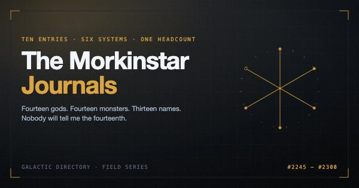

# The Morkinstar Journals



> Fourteen gods. Fourteen monsters. Thirteen names.
> Nobody will tell me the fourteenth.

Thirty-four entries from the field notebooks of **Lu'kifær Morkinstar**, correspondent for the
Galactic Directory, who visits worlds that cannot yet leave them and writes down the story
each one tells about its own weather, until the season he stops visiting anywhere at all.

Entry #2245 was written in 2021 and lives in [`archive/`](../../archive/legend-of-koaeluae-scales.md).
It had the whole frame in it and did not know it was a series yet. The other thirty-three grew out of it.

**Read it on the site:** <https://cv-siddharth.vercel.app/anthology> — all three seasons, every
entry, the plates, the tellers and the starmap.

A self-contained local copy can be rebuilt any time with `node scripts/morkinstar-site.mjs`.
It is gitignored because it is 2.2MB of generated output that changes on every run.

---

## Season One · The Directory

He files. Ten entries, each a world's legend and the phenomenon it explains. Underneath, a
count he cannot explain, a hypothesis he is wrong about, and an institution that writes
everything down badly.

| # | Entry | World | System | The phenomenon |
|---|---|---|---|---|
| 01 | [The Legend Of K'öæluæ's Scales](../../archive/legend-of-koaeluae-scales.md) | Exxobar | Alpha Axmoiri | Why it snows |
| 02 | [The Ninety-Nine Names Of Silence](02-the-ninety-nine-names-of-silence.md) | Grïnjdarlay | Alpha Axmoiri | Why nobody speaks aloud |
| 03 | [The Tide That Owes](03-the-tide-that-owes.md) | Vædrun | Alpha Axmoiri | Why the sea leaves for nine days |
| 04 | [The Word Marltains Do Not Have](04-the-word-marltains-do-not-have.md) | Marlt | Brixby | Why they talk to nobody |
| 05 | [The Arm Shake](05-the-arm-shake.md) | Killuga Var | Killuga | Why they hug strangers for a count of eleven |
| 06 | [The Standing Dead](06-the-standing-dead.md) | Jötunheimr | Ymirsgald | Why the dead are buried upright |
| 07 | [The Kindling](07-the-kindling.md) | Cendre | Cendrewake | Why they burn every book they own |
| 08 | [Two Suns, One Shadow](08-two-suns-one-shadow.md) | Solvei | Dvær Binary | Why two stars cast one shadow |
| 09 | [The World With No Number](09-the-world-with-no-number.md) | *[unnamed]* | *[unassigned]* | None. That is the phenomenon. |
| 10 | [Why We Measure Time In Hells](10-why-we-measure-time-in-hells.md) | The Galactic Directory | — | Why every date is named after an afterlife |

Canon: [`bible.md`](bible.md). Audit: [`council-2026-08-15.md`](council-2026-08-15.md).

## Season Two · The Ninety-One Pages

He stops filing. Season One's finale left him with *"a wooden case to build and ninety-one
pages to start"*, each of which must contain something nobody has ever written down. He is now
looking for worlds sliding toward Concluded and trying to keep them open.

He has not noticed what he is building.

| # | Page | Title | Where | The turn |
|---|---|---|---|---|
| 01 | 1 | [The Second Chair](s2-01-the-second-chair.md) | The case | He has no good reason for ninety-one |
| 02 | 4 | [The Weather They Made Up](s2-02-the-weather-they-made-up.md) | Vœrhan | A fabricated myth works exactly as well |
| 03 | 9 | [The Cold Case Of All Fourteen](s2-03-the-cold-case-of-all-fourteen.md) | Dhurin | A civilisation that is one long investigation |
| 04 | 16 | [The Last Thing He Taught Them](s2-04-the-last-thing-he-taught-them.md) | Ilmarrow | Lesson 341 is a title with nothing under it |
| 05 | 23 | [What You Have Not Said Out Loud](s2-05-what-you-have-not-said-out-loud.md) | Threnn | He left, and it left with him |
| 06 | 30 | [The Weight Of The Case](s2-06-the-weight-of-the-case.md) | His ship | The arithmetic comes out wrong |
| 07 | 38 | [Six Worlds, Six Fences](s2-07-six-worlds-six-fences.md) | Six worlds | They are aimed at each other |
| 08 | 47 | [The One That Stayed Open](s2-08-the-one-that-stayed-open.md) | Kaunis | You may not inherit the answer |
| 09 | 58 | [Someone Has Been Reading](s2-09-someone-has-been-reading.md) | His ship | An archive of one author is a self-portrait |
| 10 | 91 | [The Back Of The Case](s2-10-the-back-of-the-case.md) | The case | Vænheim has a number now |

Canon: [`s2-bible.md`](s2-bible.md). Audit: [`council-s2-2026-08-15.md`](council-s2-2026-08-15.md).

Page numbers skip because the pages between exist and he did not show us. By the season's end
the case is full: ninety-one of ninety-one slots. That is what forces Season Three.

## Season Three · The Kindling

The case is complete, which means it is Concluded, which is the one word he has spent two seasons
refusing. He spends this season pulling it apart: thirteen pages taken out and burned, in order,
on purpose, then one blank page kept. No world is visited. Nobody is surveyed. It is one man, one
fire, one box.

| # | Page | Title | Seen before? | The turn |
|---|---|---|---|---|
| 01 | 1 | [The Page About Ossul](s3-01-the-page-about-ossul.md) | yes | Ossul. One man writing down another man. The first thing that goes. |
| 02 | 12 | [A World That Asks The Dead One Question](s3-02-a-world-that-asks-the-dead-one-question.md) | no | A world where the dead are asked one question. Two paragraphs. |
| 03 | 16 | [The Lesson He Does Not Reread](s3-03-the-lesson-he-does-not-reread.md) | yes | Ilmarrow. Lesson 341. He does not read it again before it goes. |
| 04 | 23 | [The Thing I Did Not Say On Threnn](s3-04-the-thing-i-did-not-say-on-threnn.md) | yes | Threnn. The thing he carried out unsaid, still unsaid, burned unsaid. |
| 05 | 34 | [The Shortest Page In The Case](s3-05-the-shortest-page-in-the-case.md) | no | A page that is a single sentence and an apology for its own length. |
| 06 | 30 | [The Table That Was The Entire Entry](s3-06-the-table-that-was-the-entire-entry.md) | yes | The weighing. The table that was the entire entry. |
| 07 | 44 | [The World That Named It After Me](s3-07-the-world-that-named-it-after-me.md) | no | A world that named its monster after him. He never wrote back. |
| 08 | 47 | [The Wall With The Number On It](s3-08-the-wall-with-the-number-on-it.md) | yes | Kaunis. The wall with the number on it. |
| 09 | 61 | [The Only Page I Did Not Write Alone](s3-09-the-only-page-i-did-not-write-alone.md) | no | The only page in the case he did not write alone, and how that happened. |
| 10 | 38 | [The Map I Never Showed Them](s3-10-the-map-i-never-showed-them.md) | yes | Six fences. The map he never showed either world. |
| 11 | 73 | [Four Names And Nothing Else](s3-11-four-names-and-nothing-else.md) | no | A page that is four names and nothing else. He can place two of them. |
| 12 | 58 | [The Page Where I Worked It Out](s3-12-the-page-where-i-worked-it-out.md) | yes | The turn. Where he worked it out and kept going. |
| 13 | 91 | [The Name Goes Last](s3-13-the-name-goes-last.md) | yes | The name. Written once, on purpose, in the safest place he had. |
| 14 | — | [One Page Kept](s3-14-one-page-kept.md) | — | What he keeps. |

Canon: [`s3-bible.md`](s3-bible.md). Species and the rendering doctrine: [`species.md`](species.md).

The Concluded count appears exactly once this season, in the final piece, and it has not risen
from where Season Two left it.

---

## The art

Three layers, and which layer a thing belongs to is a canon decision, not a design one.

| Layer | What | How |
|---|---|---|
| **Plates** | One per entry. Seasons 1 and 2 draw the **mechanism** of that world's phenomenon; Season 3 draws the **fire**, a page burning. | Generated, deterministic |
| **Sigils** | One per entry. Geometry hashed from the entity's **name**. | Generated, deterministic |
| **Witnesses** | Ten hand-drawn ink-and-wash portraits of the **tellers**. | Drawn by an image model, paid for, not reproducible |

**Why the split.** Canon law five: the heroes lose, and the tellers are why there is a story at
all. Gods and monsters have no faces, so they get marks derived from their names, and renaming
one changes its mark because the mark was never the entity's. It belonged to the name. The
people are the thesis, so the people get drawn. Abstractions get geometry. Faces get faces.

Tveggi is drawn cutting the mark into stone. That is the same object as `assets/mark.svg`, which
is the same object the site uses as its section divider. The illustration and the canon are not
related. They are the same thing.

```bash
node scripts/morkinstar-plates.mjs          # 35 plates, all three seasons + cover
node scripts/morkinstar-plates.mjs 07       # one Season 1 plate
node scripts/morkinstar-plates.mjs s2-04    # one Season 2 plate
node scripts/morkinstar-plates.mjs s3-04    # one Season 3 plate
node scripts/morkinstar-art.mjs             # sigils, the mark, the-fourteen
node scripts/morkinstar-site.mjs            # rebuild site.html

# costs money, announces before spending, --probe draws exactly one
with-openrouter node scripts/morkinstar-illustrations.mjs --probe
with-openrouter node scripts/morkinstar-illustrations.mjs
```

**What is committed and what is not, and the rule is not size.** Plates and sigils are
gitignored: they come out of a script byte for byte, so keeping 45MB of PNG in git buys nothing.
**The ten portraits are committed at full resolution**, because they came out of an image model,
cost $1.40 measured, and a re-run returns *different pictures*. Derived and regenerable is safe
to ignore. Paid for and unrepeatable is not.

The general pipeline behind the portraits is reusable: see the `image-generation` skill and
`openrouter-image`.

**Season One plates are the Directory's survey form**: dark ground, cold accent, corner ticks,
`ENTRY #NNNN` in tape amber. An institution producing immaculate documentation of things it
has not understood.

**Season Two plates are his own page**: warm paper, dark ink, a case-and-slot frame with
ninety-one notches and a marker at the one you are reading.

**Season Three plates are the fire**: the same paper as Season Two, progressively scorched,
foxed, curled and gone, each one carrying a visible damaged remnant of that page's own Season One
or Season Two plate. The final plate, for the blank page he keeps, is the only clean, unmarked
paper in the season. All three seasons are meant to be distinguishable as *objects* from across a
room, because that is the premise: filing, then writing, then burning.

All three obey the same rule for the middle: **draw the mechanism, not a mood.**

## Four things that look like mistakes and are not

1. **The milgalaxal conversion does not multiply out.** 2228 Hellheims is given as 2455 Earth
   years when a click is 2 Earth years. That error is inherited from the 2021 original and
   Entry #2300 is built on it. It is the last surviving measurement of a Concluded world.
   Never correct it.
2. **Entry #2300 ends mid-sentence.** It is filed incomplete on purpose. Never finish it.
3. **Season Two never uses the word "concluding".** Season One's sign-off was *"This is
   Lu'kifær Morkinstar concluding Journal Entry #NNNN."* He does not say it any more. That is
   the whole season.
4. **No description in any entry is a photograph, and the art is not inconsistent for varying.**
   Everything in this anthology arrived through a translation rig and a Directory form, both
   argued with in the text, both fallible. A plate that reads humanlike is a rendering that
   resolved toward the familiar. A plate that is half-dissolved is one where the rig strained.
   A plate that is mostly absence (Ossul's) is a refusal, because his species is never named in
   thirty-four entries and the rig does not get to invent one. This is the **Rendering
   doctrine**, canon since 2026-08-15: see [`species.md`](species.md) and the "Rendering"
   section of [`bible.md`](bible.md). A reader who does not know it will look at ten
   inconsistent-seeming portraits and conclude the art direction wandered. It didn't.

## Provenance

All three seasons audited by multi-lens Claude councils plus cross-family ensembles via
OpenRouter (cross-lab.0474 and cross-lab.0420, measured, for Seasons 1 and 2). The Season 2
audit was an **ownership test**: ten premises sent to seven labs with no context, asking them to
name the source. Six were named by two or more labs independently and were killed. What
survived, what died, and the dissents are recorded in the two council files.

Season 3 went through the same ownership test twice (cross-lab.0423 killed the first
fourteen-author design on three structural counts; cross-lab.0414 cleared its replacement but
forced the engine described in "The clock" and "The engine" sections). That audit trail is
recorded inline in [`s3-bible.md`](s3-bible.md) rather than a separate council file, since both
rulings landed on the same design document before any page was written.

This is not The Loopdown's cosmology. Different fiction, no crossover. They rhyme, and the
rhyme is the reward.
