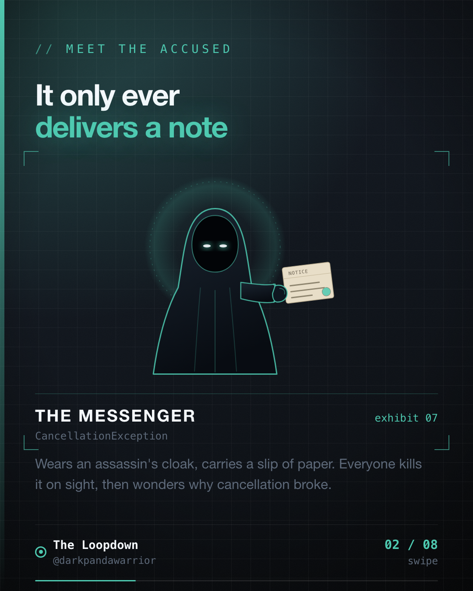
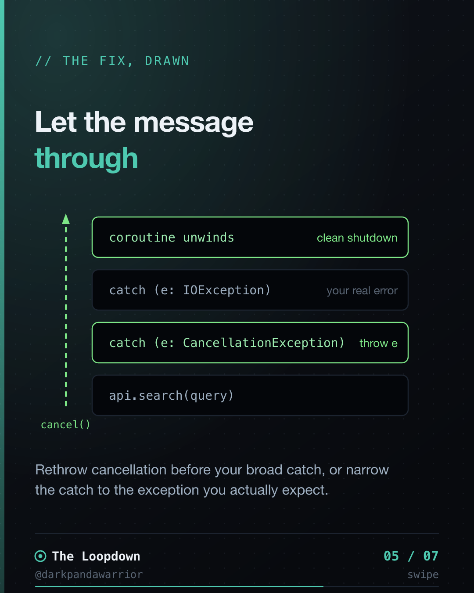
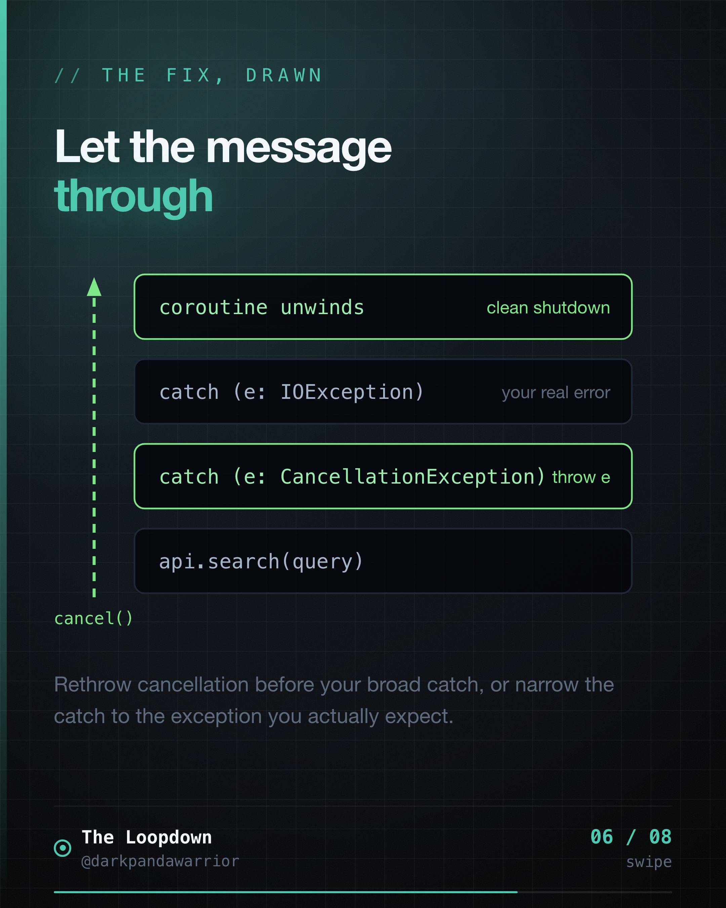

I cancelled a coroutine. It kept running for 8 more seconds. It just did not care.

This was a search screen. You type, it fires a network request. Type again, it cancels
the old request and fires a new one. Standard stuff. Except the old request kept
running, and every so often it finished last and painted stale results right over the
fresh ones. I had called cancel. I had watched it run in the debugger. The job was
"cancelled." And still it went on.

The culprit was one line I wrote myself.



## Cancellation is a message, not a bullet

This is the part people miss about Kotlin coroutines. Cancelling one does not reach
in and kill it. It cannot. The coroutine has to cooperate. So the machinery throws a
`CancellationException` up through your suspend calls, and that exception is the
message: we are done, unwind, release your resources, stop.

Your job is to let that message travel. Most cancellation bugs are really one bug: you
stopped the message from traveling.

## The line that ate the message

```kotlin
try {
    results = api.search(query)   // a suspend call
} catch (e: Exception) {
    log("search failed")
}
```

This looks careful. It looks like good defensive code. It is a trap.

`CancellationException` extends `Exception`. So when cancellation fires mid-request,
this `catch (e: Exception)` grabs it, logs "search failed", and carries on as if a
network error happened. The coroutine never unwinds. The framework thinks you handled
something. The work continues.

You caught the messenger, logged that he looked upset, and locked him in a cell. The
message he was carrying never got delivered.



## Four ways to stop doing this

**1. Catch what you actually expect.** Ninety percent of the time you do not want
`Exception`. You want the specific thing that can go wrong.

```kotlin
try {
    results = api.search(query)
} catch (e: IOException) {
    showOfflineState()
}
```

`CancellationException` is not an `IOException`, so it sails right past and does its
job.

**2. If you must catch broadly, rethrow cancellation first.**

```kotlin
try {
    results = api.search(query)
} catch (e: CancellationException) {
    throw e                       // let the message through
} catch (e: Exception) {
    log("search failed")
}
```

**3. Know that `runCatching` has the same trap.** It is a lovely little helper and it
catches `CancellationException` too.

```kotlin
val result = runCatching { api.search(query) }   // also swallows cancellation
```

If you use it inside a coroutine, check for cancellation and rethrow, or do not use it
there.

**4. For cleanup that must run even while cancelling, use `NonCancellable`.** A naked
catch is the wrong tool for "always close this".

```kotlin
try {
    stream.write(data)
} finally {
    withContext(NonCancellable) {
        stream.flushAndClose()    // runs even though the coroutine is cancelling
    }
}
```



## Why the language made it this way

Structured concurrency is the reason. When a parent scope cancels, every child needs to
wind down cleanly and report back up. That only works if cancellation propagates. If any
link in the chain swallows the exception, the parent never learns the child stopped, and
your careful tree of coroutines turns into orphans that run in the dark.

So `CancellationException` is not an error to be defended against. It is the one
exception in the system that is doing exactly what you asked. It is the app shutting
things down cleanly, on time, on request.

## The takeaway

Cancellation is a conversation, not a kill switch. If you swallow the message, the work
does not stop. It just stops telling you it is still running.

Do not shoot the messenger.
