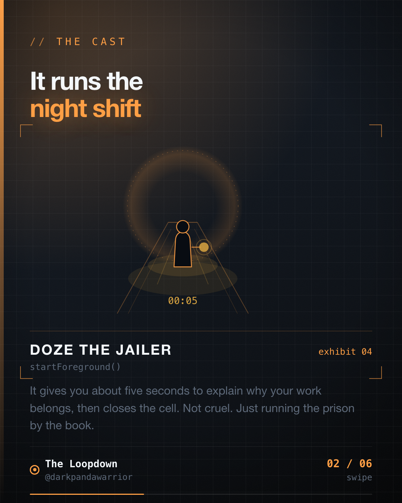
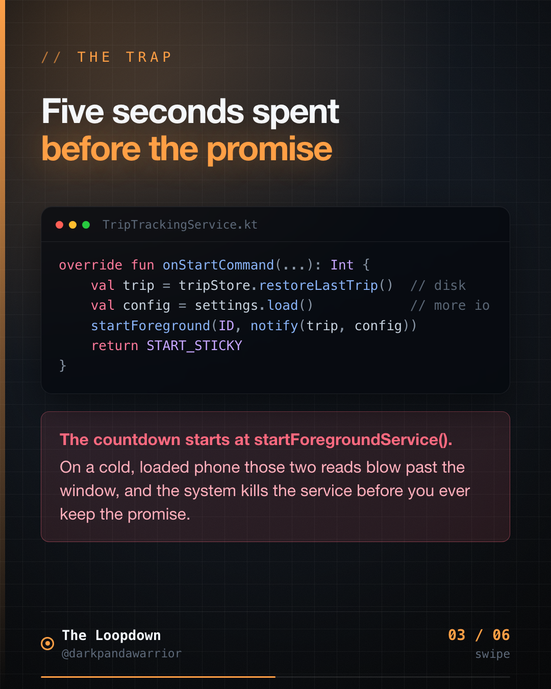
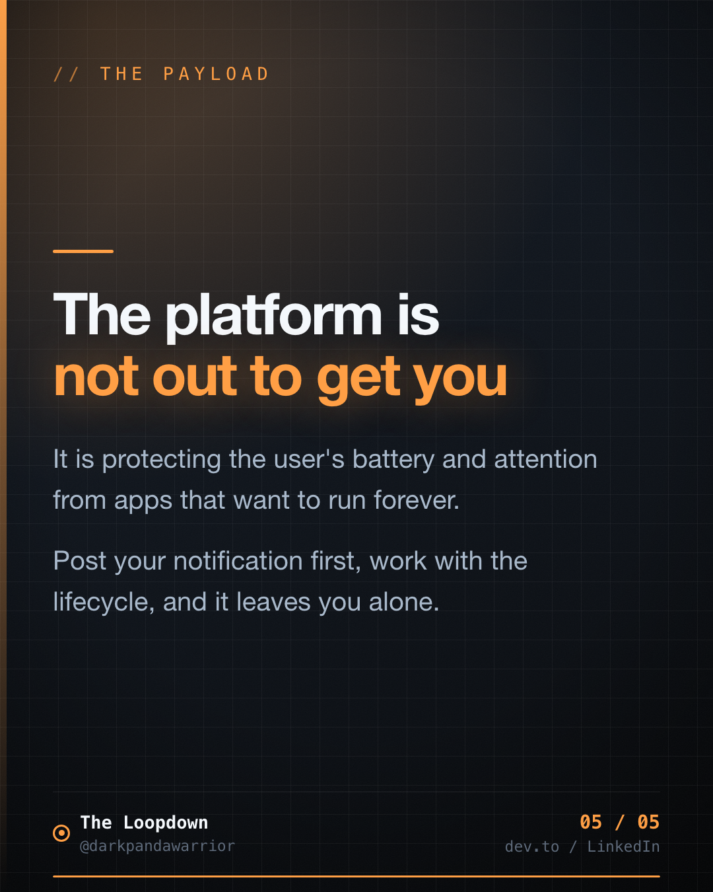

# The 5-second window that crashes your service

## The hook

<!-- figures:start -->

<!-- figures:end -->

Primary: Our service crashed for thousands of users, and the stack trace blamed a line that does nothing wrong.

Variants to A/B:
- ForegroundServiceDidNotStartInTimeException. I had never heard of it either.
- Android gives your service 5 seconds to justify itself. Then it pulls the plug.
- The bug only happened on cheap phones. That was the clue.

## The insight

<!-- figures:start -->

<!-- figures:end -->

When you start a foreground service, you promise the system you will show a notification
and do visible work. The system gives you about 5 seconds to keep that promise by calling
startForeground(). Do slow work before that call and a cold, loaded device blows past the
window. The system does not wait. It kills the service. Post the notification first, do
the slow work after.

## The story / how it played out

<!-- figures:start -->

<!-- figures:end -->

Location tracking on Mileway runs in a foreground service. It worked on every phone in
the office. In the crash logs it was falling over for a slice of real users, always the
same exception: ForegroundServiceDidNotStartInTimeException.

The code read some setup from disk, restored the last trip, then posted the notification
and called startForeground(). On my phone that setup took 80 milliseconds. On a cheap
device under memory pressure it took four or five seconds, and by the time we called
startForeground() the system had already given up on us.

The fix:
1. Call startForeground() first, immediately, with a minimal notification.
2. Do the slow work after, then update the notification when you have real content.
3. On Android 12 and up, you often cannot start a foreground service from the background
   at all. Use WorkManager with an expedited request instead.

## The takeaway

<!-- figures:start -->

<!-- figures:end -->

The platform is not out to get you. It is protecting the user's battery and attention
from apps that want to run forever. Post your notification first, work with the
lifecycle, and it leaves you alone.

## Receipts
- Real crash cluster on Mileway, only on low-end devices under load.
- Fixed by moving startForeground() to the first line and deferring setup.
- Part of the 80 percent crash-reduction work.

## Lore
Doze the Jailer debuts here. Runs the night shift and gives you 5 seconds to explain why
your work deserves to keep running. Explain fast or the cell door closes. Series: The
Night Shift, iteration 3. Sign-off: "filed from iteration 3 of the loop."
