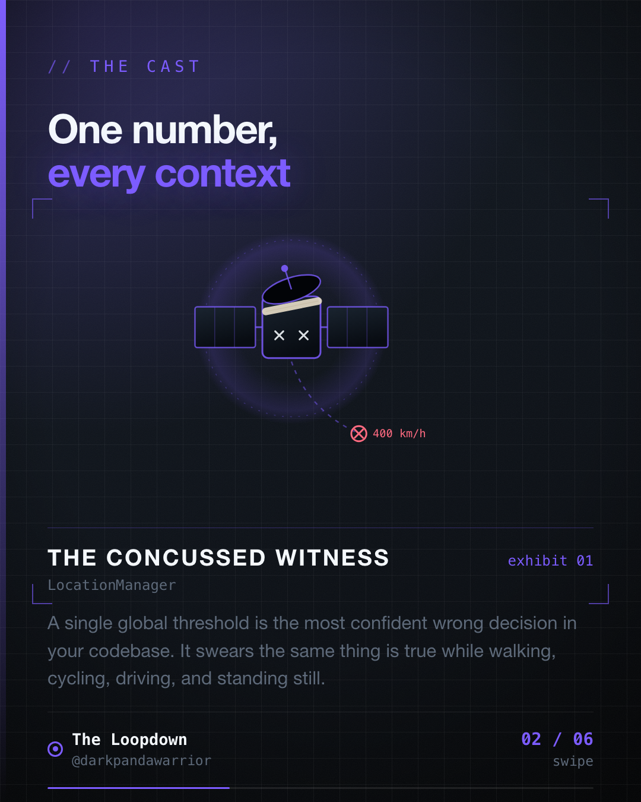
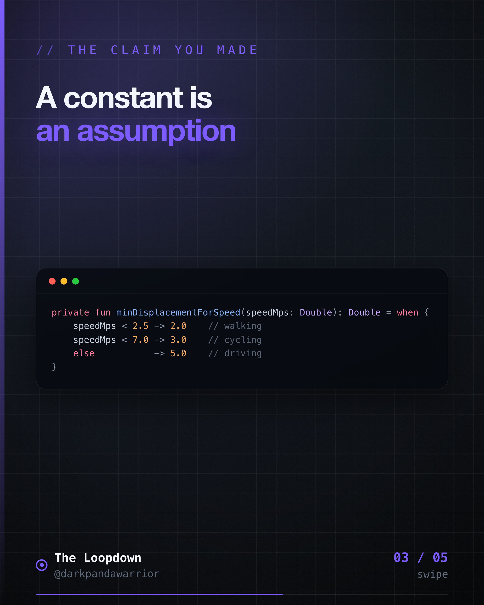
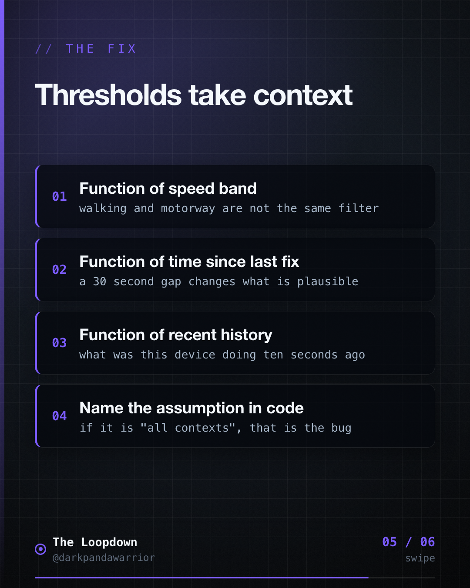
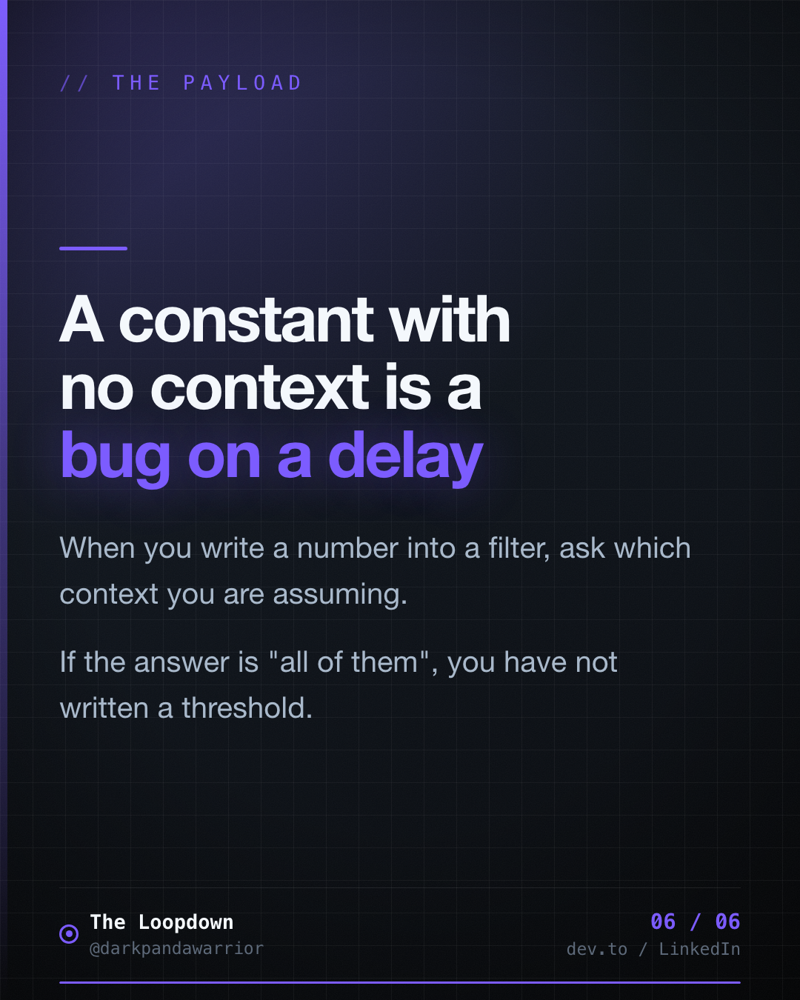

Our GPS filter worked perfectly, right up until someone sat in Bangalore traffic.




## The phantom distance problem

<!-- figures:start -->

<!-- figures:end -->

A parked phone does not sit still in the data. The reported position wanders a few metres in every
direction, and if you naively sum the gaps between readings, a stationary car quietly accumulates
kilometres. On a mileage app that becomes an expense claim, so it matters.

The fix looks trivial. Ignore any step below some minimum:

```kotlin
if (displacement < MIN_DISPLACEMENT_M) return   // 5.0, felt about right
```

Parked cars stop drifting. Tests pass. Ship.

Then a driver crawls through traffic at walking pace for forty minutes. Every genuine step they
take is under five metres. We deleted the whole journey and told them they had not moved.

## The constant was making a claim

<!-- figures:start -->

<!-- figures:end -->

`MIN_DISPLACEMENT_M = 5.0` looks like a number. It is really an assertion: five metres means the same thing
whether you are parked, walking, cycling, on a motorway, or crawling in first gear. That assertion
is false, and the filter had no way to know it.

Every threshold worth keeping is a function of context. Ours ended up depending on three things.

### 1. Speed bands

```kotlin
private fun minDisplacementForSpeed(speedMps: Double): Double = when {
    speedMps < 2.5 -> 2.0    // walking
    speedMps < 7.0 -> 3.0    // cycling
    else           -> 5.0    // driving
}
```

Faster travel expects and tolerates bigger steps between readings. Slower travel needs a tighter
gate or you erase it.

### 2. Time-gap tiers

An implausible speed is only implausible relative to how long you were not looking. Under normal
sampling, a 5km jump is a teleport. After a six hour gap it is a commute.

```kotlin
private fun isAbnormal(displacement: Double, impliedSpeed: Double, dtSec: Long) = when {
    dtSec < 30      -> displacement > 5_000 || impliedSpeed > 70.0  // ~252 km/h
    dtSec <= 300    -> impliedSpeed > 150.0
    dtSec <= 3_600  -> impliedSpeed > 100.0
    dtSec <= 21_600 -> impliedSpeed > 60.0
    else            -> displacement > 10_000   // stop testing speed entirely
}
```

Tunnels, killed processes, flights and genuine glitches all produce a jump. The gap is what tells
them apart, so the gap has to be an input.

### 3. Recent history

This is the one that actually rescued the traffic case. A small step is only treated as jitter
when the recent window agrees that nothing is happening:

```kotlin
private fun hasMovementHistory(): Boolean =
    recentSpeedHistory.isNotEmpty() && recentSpeedHistory.average() >= 1.5   // last 5 fixes
```

Sustained slow movement is movement. Genuine stillness is stillness. A rolling window can tell
them apart. A constant never could.

## Make them configurable while you are at it

Once thresholds are context-dependent there are more of them, and you will get some wrong. Ours
live in one serialisable object rather than scattered `const val`s:

```kotlin
@Serializable
data class AbnormalDetectionConfig(
    val walkingMaxMps: Double = 2.5,
    val walkingJitterM: Double = 2.0,
    val cyclingJitterM: Double = 3.0,
    val drivingJitterM: Double = 5.0,
    val speedHistorySize: Int = 5,
    val movementHistoryMps: Double = 1.5,
    val spikeHardGateM: Double = 5_000.0,
    // ...gap tiers
)
```

Tuning becomes a config change rather than a release. The defaults reproduce the old hardcoded
values exactly, so extracting them proved nothing changed.

## The takeaway

<!-- figures:start -->

<!-- figures:end -->

When you write a constant into a filter, ask what context you are assuming. If the answer is "all
of them", you have not written a threshold. You have written a bug with a delay on it.
