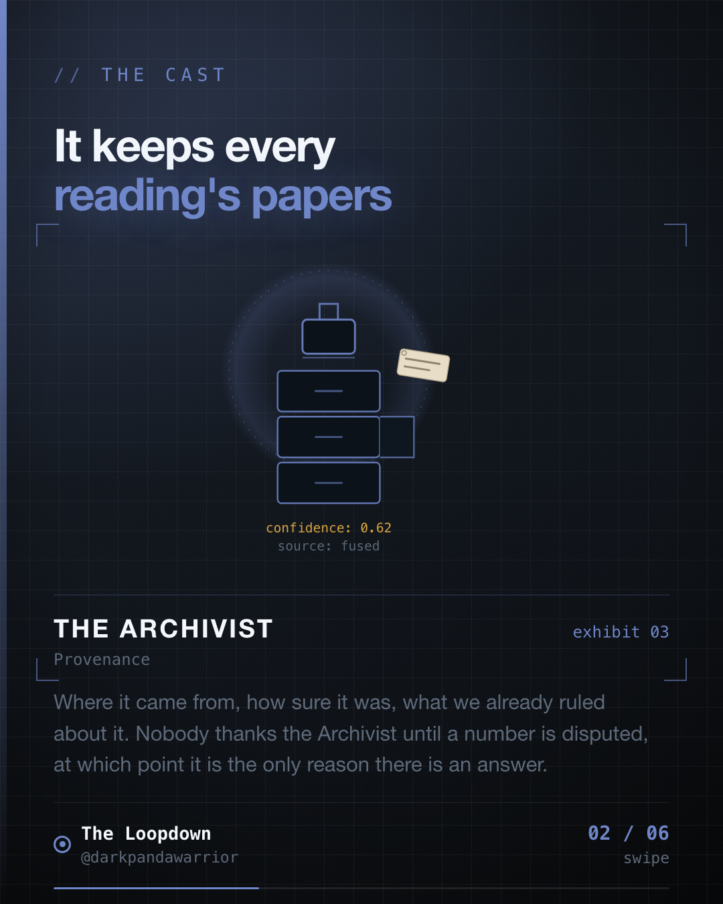
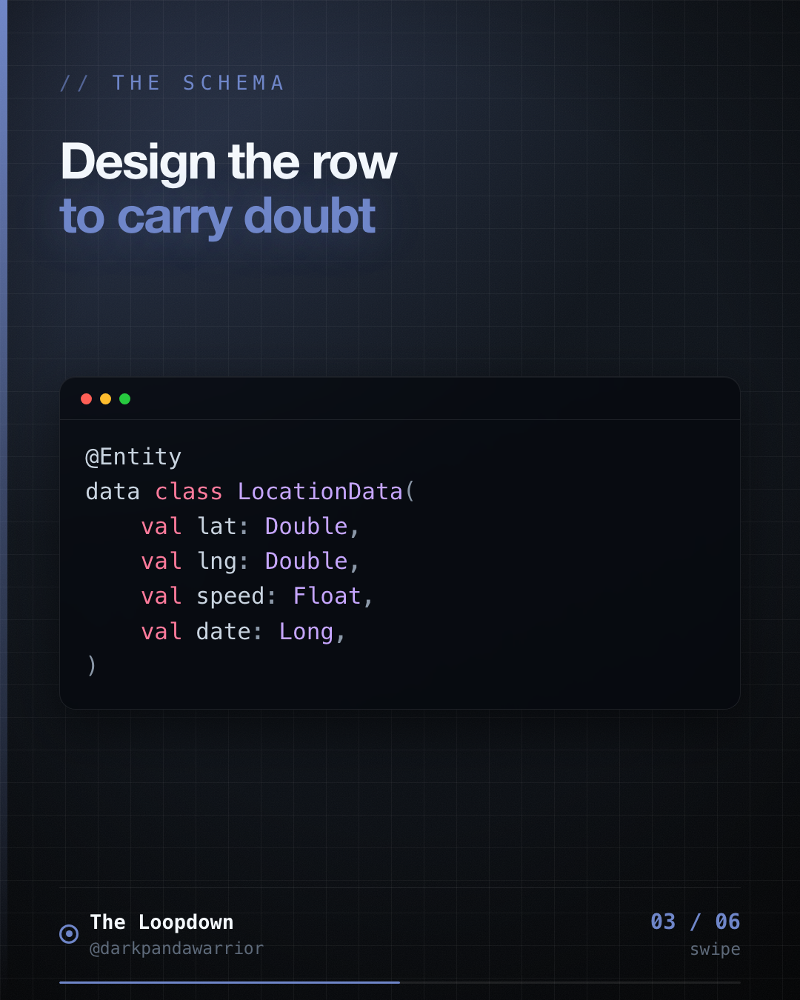
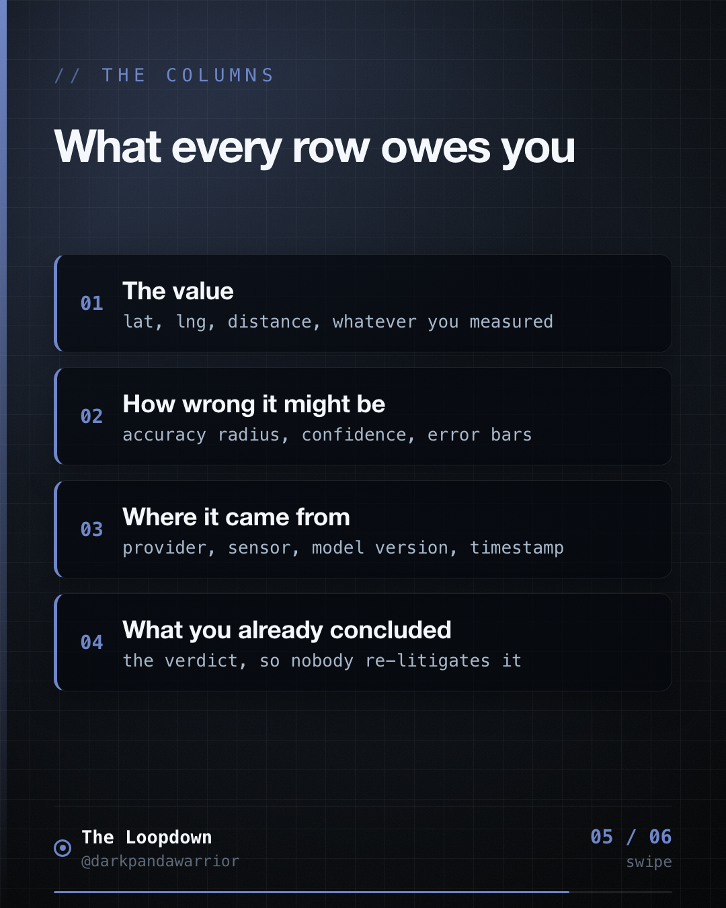

# Your data model is where uncertainty goes to die

## The hook

<!-- figures:start -->

<!-- figures:end -->

Primary: The sensor knew how much to trust itself. Our database column did not have room for that,
so we threw it away on the way in.

Variants to A/B:
- Every GPS reading arrives with an error estimate. Most schemas store the coordinate and bin it.
- The moment a row is just lat and lng, the uncertainty is gone forever and nothing downstream
  can get it back.
- Your table schema is a claim about what matters. Most of them claim confidence does not.

## The insight

<!-- figures:start -->

<!-- figures:end -->

Sensors and upstream systems almost always tell you how much to trust them. GPS ships an accuracy
radius, a provider, a timestamp. Models ship a confidence. APIs ship a staleness. Then we design a
table with the value and drop the rest, and every downstream consumer is forced to treat a 4 metre
fix and a 200 metre fix as the same fact. Uncertainty does not get lost in the algorithm. It gets
lost at the schema.

## The story / how it played out

<!-- figures:start -->

<!-- figures:end -->

Android hands you a Location with accuracy in metres, the provider that produced it, a bearing,
an altitude, and a timestamp. Our early row kept lat, lng, speed and time. Everything else was
dropped at the door because it was not needed yet.

Then every hard question became unanswerable. Was this journey tracked well or badly? Which
readings were fused and which were raw GPS? Was the phone moving when this arrived? We were not
missing an algorithm, we were missing columns.

The row we persist now carries the reading and its papers: accuracy, provider, bearing, altitude,
locationTime, battery percentage, the gyroscope and accelerometer snapshot, device model and app
version, plus the decisions we already made about it (isMock, isAbnormal, isPaused, displacement).

That last part matters as much as the sensor data. We store our own verdict next to the evidence,
so a later reader can see both what we decided and what we decided it from.

On top of it sits a live quality score, 0 to 100, that turns environment into a single number the
UI can act on: penalties for mock location, missing permission, battery optimisation, power saver,
a killed process, GPS off, plus an accuracy tier penalty and a small bonus for a stable stream.

## The takeaway

<!-- figures:start -->

<!-- figures:end -->

Design the row to carry doubt. If a value can be wrong, the schema needs somewhere to say how
wrong, where it came from, and what you already concluded. Add those columns before you need them,
because you cannot backfill confidence that was discarded at write time.

## Receipts
- Mileway LocationData persists accuracy, provider, bearing, altitude, IMU, battery, device model
  alongside isMock / isAbnormal / isPaused / displacement.
- TrackingQualityScorer turns environment into a 0-100 confidence number carried with the session.

## Lore
The Archivist debuts. Keeps every reading's papers in order: where it came from, how sure it was,
what we ruled about it. Boring, meticulous, and the only reason anything can be re-examined later.
Series: Chain of Custody, iteration 9.
