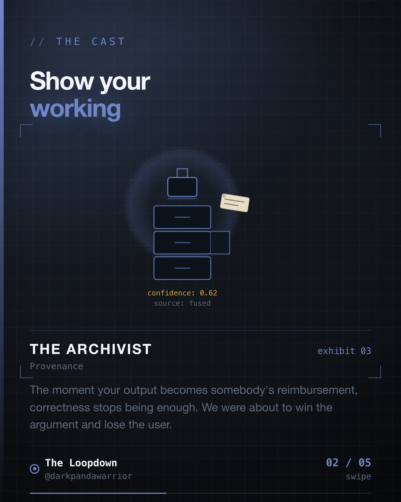

Our algorithm decided a driver had travelled 4km less than they thought. It was probably right.
Shipping that silently would still have been wrong.




## When cleaning stops being technical

Mileage tracking ends in an expense claim. Someone drives, the app measures, and the measurement
becomes money.

Our pipeline removes several categories of distance: readings from mock location apps, physically
implausible jumps, and teleport spikes over five kilometres in a single step. The resulting number
is more accurate than the raw sum. That is not in dispute.

The mistake is thinking accuracy is the whole job.

A driver who believes they did 40km and sees 36km cannot distinguish between a careful algorithm
and an employer quietly trimming expenses. From where they sit, both look identical: a smaller
number, no explanation. Being right is invisible.

## Explicit degradation, in the UI

The fix is not better filtering. It is showing the work.

**Show the original next to the cleaned figure.** Both numbers exist in the data model, so both
can appear. The user sees that we measured 40km and are proposing 36km, rather than discovering
36km as if it were the only thing that ever happened.

**Name what was removed.** Not "adjusted for accuracy" but the actual categories: abnormal
distance, mock distance, spike distance. Categories are checkable. Vagueness is not.

**Let them overrule it.** The trip screen has a toggle for whether the abnormal segment is
subtracted:

```kotlin
var final = smartAnalysis.originalDistance
if (removeAbnormal) final -= smartAnalysis.abnormalDistance
```

This one gets pushback in review. Why let a user override the algorithm? Two reasons. They were
physically present and we were not, so on a genuinely ambiguous journey they hold information the
pipeline does not. And if our threshold is wrong, this is the cheapest possible feedback channel.
The alternative is not that they accept it. The alternative is that they escalate to their finance
team, who escalate to us, three weeks later, with no data attached.

**Do not cry wolf.** In the irregularities view, an app-killed event is explicitly classified as
not an irregularity, because the tracker recovers on its own. If every notice is alarming, users
learn to dismiss all of them, and the disclosure you worked on becomes noise.

## This needs the data model to cooperate

None of this is possible if the pipeline throws away what it rejects. Showing original versus
cleaned requires both numbers to survive. Naming the categories requires per-category
accumulators. Letting the user toggle removal requires the removed distance to still be sitting
there, addable back.

Transparency is a data-modelling decision made months before it becomes a UI decision.

## The general case

The pattern applies well beyond mileage. Fraud scores that block a transaction. Ranking systems
that decide what a seller earns. Time trackers. Usage-based billing. Anything where a system's
output becomes an input to somebody's money, time, or reputation.

For those systems, correctness is table stakes. The actual product is: show the original, show the
delta, show the reason, and let them push back.

Being right in silence is just asking to be trusted. Showing the working is how you earn it.
