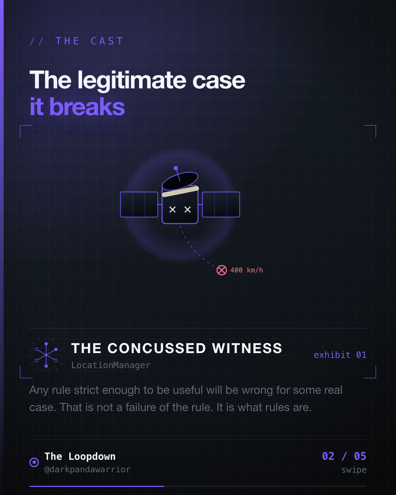
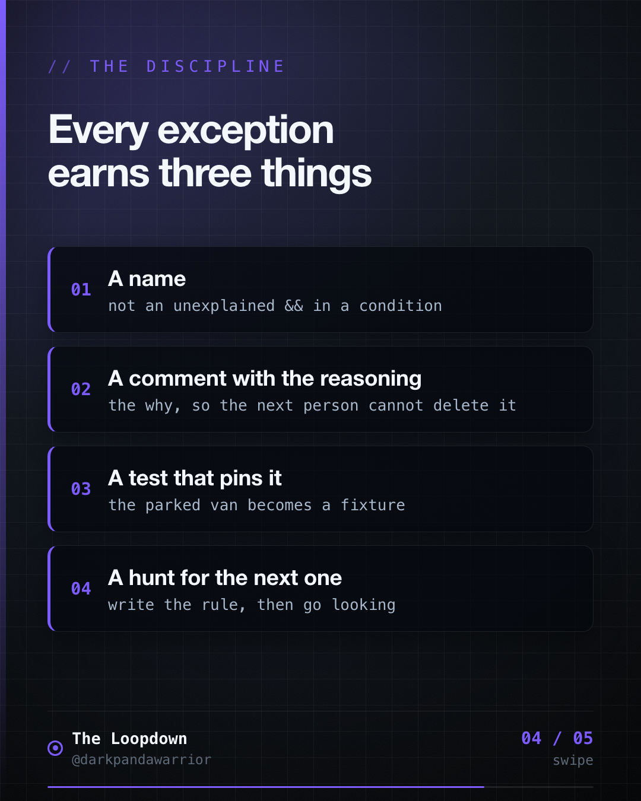
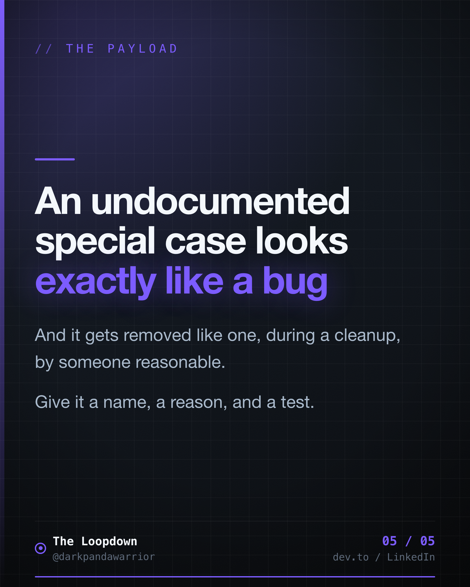

A filter with no exceptions has not met production yet. It has only met your test data.




## The rule that was right nearly always

<!-- figures:start -->

<!-- figures:end -->

GPS reports an accuracy radius with every reading. Ours had a straightforward rule: anything worse
than 50 metres is persisted, but does not count toward trusted distance.

```kotlin
val accuracyGated = fix.accuracyM > MAX_ACCURACY_THRESHOLD_M   // 50.0
```

This is sound. A 200 metre radius means the phone is in a basement, an underground car park, or
surrounded by reflective towers. Counting that as travelled distance produces nonsense.

Then we hit the legitimate case: a vehicle parked for a long stop. Genuinely stationary. Decent
fix. But occasionally reporting a slightly wider radius, and under the blanket rule those readings
stopped contributing. The stop appeared as a hole in the journey.

## Two bad fixes and one good one

**Loosen the threshold.** Move 50 to 70 and the complaint disappears, along with the protection
you added the rule for. This is not solving the edge case, it is deleting the rule.

**Special-case it silently.** Add `|| fix.speedMps < 0.1` somewhere in the condition, move on. It
works today and becomes archaeology within a quarter.

**Name the exception.** What we actually did:

```kotlin
// Stationary after recent movement with still-reasonable accuracy: the device is
// reliably placed, not drifting, so it may contribute despite the accuracy gate.
val exceptionalStationary =
    fix.speedMps <= EXCEPTIONAL_STATIONARY_SPEED_MPS &&   // 0.1 m/s: genuinely not moving
        fix.accuracyM < EXCEPTIONAL_STATIONARY_ACCURACY_M && // 20m: still a good fix
        hasMovementHistory()                                  // and it was moving recently

val accuracyGated = fix.accuracyM > maxAccuracyThreshold && !exceptionalStationary
```

Three conditions, all required, describing exactly one situation. The rule stays strict for
everyone else.

## Why the name is the important part

The logic here is four lines. Any competent engineer would arrive at something similar. What makes
it survive is that it is called `exceptionalStationary` and carries a comment explaining the
reasoning.

An unnamed condition is indistinguishable from a bug, and it gets treated like one. Somebody
tidying up in six months sees `speedMps <= 0.1f && accuracyM < 20f && hasMovementHistory()` inline
in a boolean, cannot work out why anyone would want that, and removes it. Tests pass, because
nobody wrote a test for a case nobody could explain. The regression surfaces in support tickets a
month later.

A named exception with a comment and a test is a different object entirely. It says: this is
deliberate, here is the situation, here is why the general rule is wrong for it.

## The other exception in the same pipeline

There is a second one worth showing, because it demonstrates the discipline that keeps exceptions
from metastasising. After a pause and resume, the user may genuinely have moved while tracking was
off, so the teleport-spike gate is relaxed for a grace window.

But the accuracy gate stays fully enforced during that window.

Relaxing one rule must never silently relax the neighbours. An exception should be as narrow as
the situation that justifies it, and no narrower than the code makes explicit.

## The takeaway

<!-- figures:start -->

<!-- figures:end -->

Write the rule. Then go looking for the legitimate case it breaks, because there is always one.
When you find it, do not weaken the rule and do not smuggle in a condition. Give it a name, a
comment with your reasoning, and a test.

Undocumented special cases do not survive contact with a refactor. Documented ones do.
