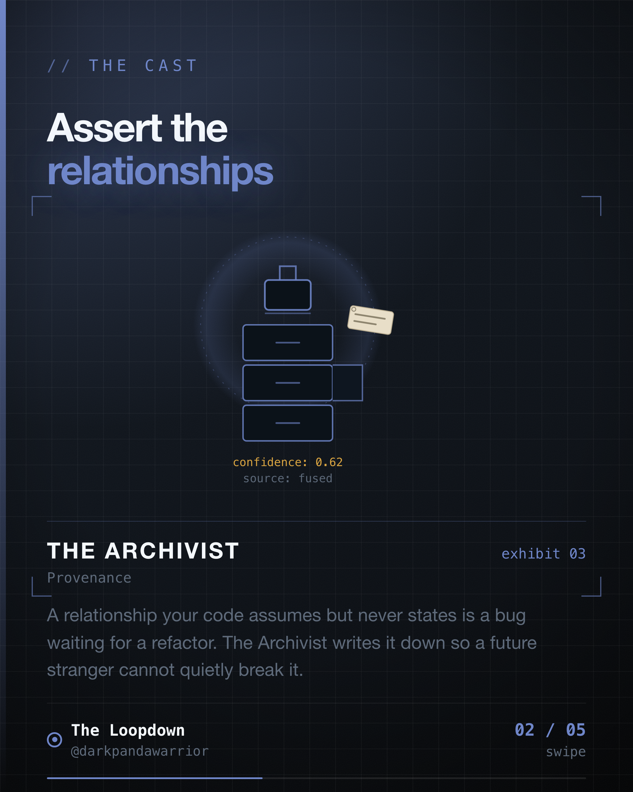

We had five numbers that were supposed to add up. Nothing in the codebase checked that they did.




## The relationship nobody wrote down

A tracked journey produces five distance figures: `original`, `cleaned`, `mock`, `abnormal` and
`spike`. Anyone on the team could tell you how they relate:

```
cleaned = original - (mock + abnormal)
```

With one wrinkle. `spike` is not in that equation, because spike distance is never folded into
`original` in the first place, so subtracting it again would double count. It is tracked separately
for reporting only.

That wrinkle is the kind of thing that survives exactly as long as the person who wrote it. It
looks like an oversight. A reasonable engineer refactoring this code in a year would "fix" it.

## Making the rule executable

```kotlin
object DistanceValidator {
    private const val TOLERANCE_METRES = 0.1

    fun validate(m: DistanceMetrics): ValidationResult {
        val errors = mutableListOf<ValidationError>()
        val warnings = mutableListOf<ValidationWarning>()

        // negatives are always a bug
        listOf("total" to m.total, "cleaned" to m.cleaned, "mock" to m.mock,
               "abnormal" to m.abnormal, "spike" to m.spike)
            .forEach { (field, v) -> if (v < 0) errors += NegativeDistance(field, v) }

        // CRITICAL: spike is excluded here. It is never folded into `total`,
        // so it isn't subtracted back out of `cleaned` either.
        val expectedCleaned = m.total - (m.mock + m.abnormal)
        val diff = abs(m.cleaned - expectedCleaned)
        if (diff > TOLERANCE_METRES) errors += ComponentMismatch(expectedCleaned, m.cleaned, diff)

        if (m.cleaned > m.total) errors += CleanedExceedsTotal(m.cleaned, m.total)
        // ...ratio warnings
        return ValidationResult(errors, warnings)
    }
}
```

The loud comment is deliberate. The invariant now enforces the wrinkle, and the comment explains
it, so the refactor that would have broken it fails a test instead.

The tolerance matters too. These are accumulated floating point sums, so exact equality would
produce false failures. 0.1 metres is well below anything meaningful and well above accumulated
error.

## Two tiers, doing different jobs

**Errors block submission.** Negative distances, component mismatch, cleaned exceeding total.
These mean the code is wrong. The numbers contradict each other and nothing downstream should
trust them.

**Warnings surface without blocking.** This tier is the one that earns its keep:

```kotlin
if (m.mock / m.total > 0.5)                      warn(UnusualRatio("mock", ratio))
if (m.abnormal / m.total > 0.5)                  warn(UnusualRatio("abnormal", ratio))
if (m.spike / (m.total + m.spike) > 0.3)         warn(UnusualRatio("spike", ratio))
if (abs(odometer - m.total) / odometer > 0.3)    warn(LargeDiscrepancy("odometer-vs-gps", ratio))
```

These are a fundamentally different kind of statement. The strict invariant catches code bugs. The
ratios catch something internal consistency never can: a threshold being wrong.

Every one of those five numbers can be perfectly consistent with the others while the filter
quietly discards half of a genuine journey. The arithmetic is fine. The classification is not. If
most of a real trip is landing in the abnormal bucket, our detection is wrong, not the driver, and
only a ratio check will ever tell you.

The odometer check goes further still. It compares against a genuinely independent measurement, so
it can catch errors that no amount of self-consistency would reveal.

## Why this is cheap

The whole validator is around eighty lines of pure Kotlin. No Android dependency, no I/O, no
mocking. It is a function from data to a result, which means it is trivially unit testable and
runs in milliseconds before submission.

Against that: distance figures that quietly drift wrong for weeks, discovered through a support
queue, with no way to identify which journeys were affected.

## The takeaway

Every system has relationships it assumes and never asserts. Components summing to a total. A
subset never exceeding its parent. Two independent measurements staying within range. A count
matching between client and server.

Those rules usually live in a comment, or a Slack message, or nowhere at all. Write them as code
that runs. Errors for what must never happen, warnings for what is merely suspicious. Both before
the data leaves.
