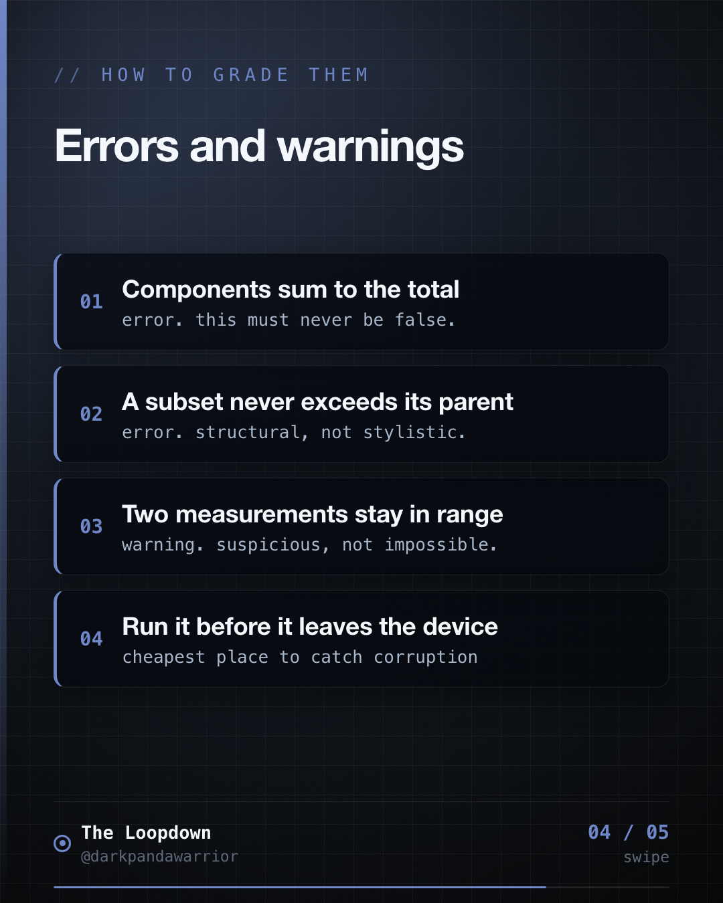
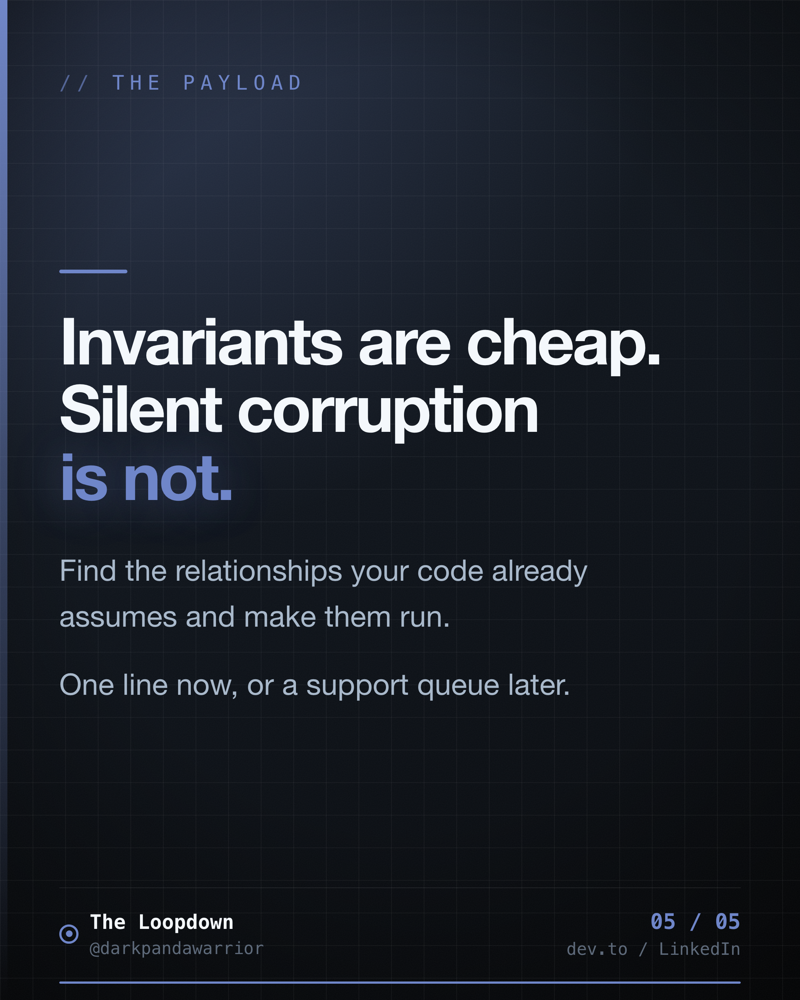

# Invariants are cheap. Silent corruption is not.

## The hook

<!-- figures:start -->

<!-- figures:end -->

Primary: We had five numbers that were supposed to add up. Nothing in the codebase checked that
they did, and for a while they quietly did not.

Variants to A/B:
- A relationship your code assumes but never asserts is a bug waiting for a refactor.
- The assertion is one line. Finding out later costs a support queue.
- If your data has a rule, write the rule down as code that runs.

## The insight
Every system has relationships between values that must hold: components summing to a total, a
subset never exceeding its parent, two independent measurements staying within range of each
other. These usually live in someone's head or a comment. Writing them as a validator that runs
before persistence or submission is one of the highest-value-per-line things you can do.

## The story / how it played out

<!-- figures:start -->

<!-- figures:end -->

Our distance model has five numbers: original, cleaned, mock, abnormal and spike. They are related:

```
cleaned = original - (mock + abnormal)
```

Spike is deliberately excluded because it is never folded into the total in the first place, so it
must not be subtracted back out. That is exactly the kind of subtlety a future refactor gets
wrong, and for a while nothing enforced any of it.

So we wrote a validator that runs before submission. Errors block: any negative distance, a
component mismatch beyond a 0.1 metre floating point tolerance, cleaned exceeding original.

Warnings surface without blocking, and this is where it earns its keep:
mock or abnormal above 50 percent of the total, spike above 30 percent, or GPS distance diverging
from the vehicle odometer by more than 30 percent.

Those ratio checks are a different kind of statement. The strict invariant catches code bugs. The
ratios catch a threshold being wrong, which no amount of internal consistency would reveal. If
most of a real journey is landing in the abnormal bucket, our detection is wrong, not the driver.

The comment above the invariant is deliberately loud, because the spike exclusion looks like an
oversight until you know why.

## The takeaway

<!-- figures:start -->

<!-- figures:end -->

Find the relationships your code assumes and make them executable. Errors for what must never
happen, warnings for what is merely suspicious. Both should run before the data leaves the device.

## Receipts
- Mileway DistanceValidator: enforces cleaned = total - (mock + abnormal), spike excluded.
- Blocking errors for negatives, mismatch beyond 0.1m, cleaned > total.
- Ratio warnings at 50% mock/abnormal, 30% spike, 30% odometer divergence.

## Lore
The Archivist keeps the ledger balanced. Not because anyone enjoys bookkeeping, but because the
day someone disputes an entry, a balanced ledger is the only thing that settles it. Series: Chain
of Custody, iteration 13.
