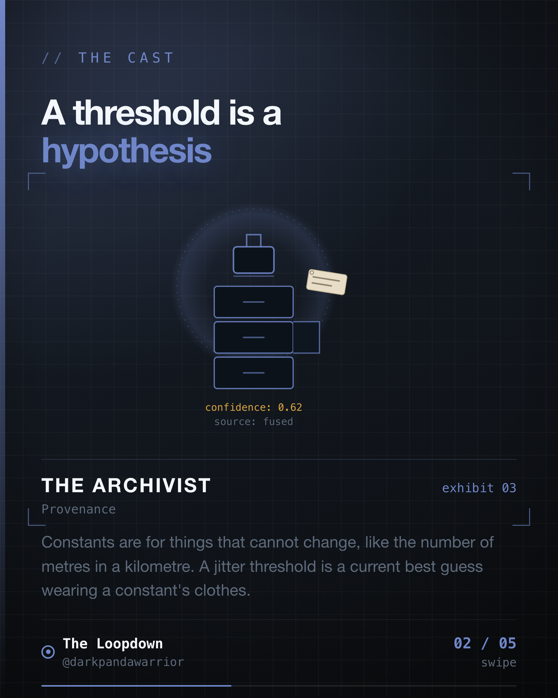
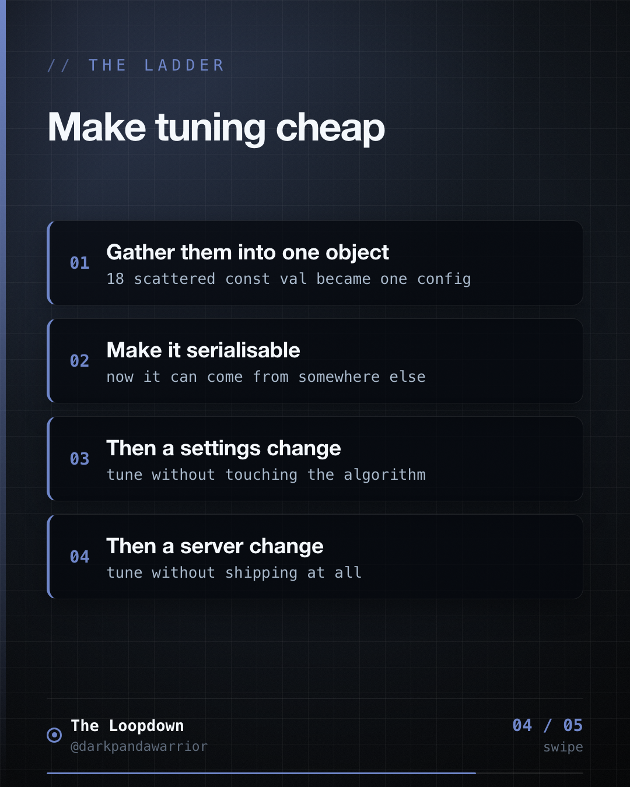
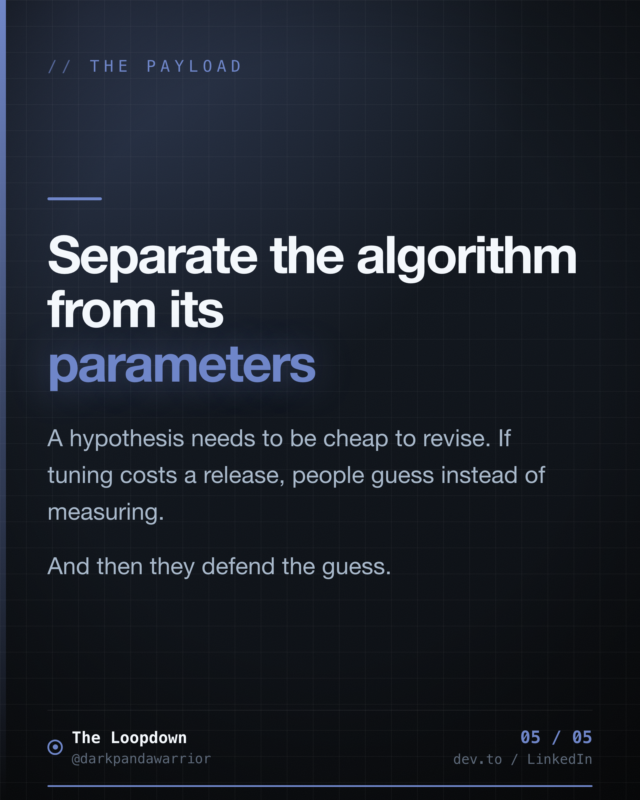

# Your thresholds do not belong in constants

## The hook

<!-- figures:start -->

<!-- figures:end -->

Primary: Every tuning change needed a release, a review, and a week of store rollout. So we
stopped tuning, which is the worst possible outcome.

Variants to A/B:
- A magic number in a const val is a decision you can only revisit by shipping an APK.
- We had 18 thresholds spread across one file. Moving them into one object changed how we worked.
- If tuning requires a release, you will guess instead of measure.

## The insight
Heuristic thresholds are not constants, they are current best guesses. Storing them as const val
means every correction costs a full release cycle, so people stop correcting them and start
defending them. Move them into one serialisable config object and tuning becomes a settings
change, then eventually a server change, without touching the algorithm.

## The story / how it played out

<!-- figures:start -->

<!-- figures:end -->

Our location pipeline accumulated about eighteen tuning numbers: speed band boundaries, jitter
gates per band, a stationary threshold, a rolling window size, a movement threshold, a spike gate,
four gap tiers with their speed caps, a maximum gap distance. All const val, scattered through the
processor.

Every one of them was a guess we would want to revisit with real data. Every revisit meant a code
change, a review, a build, a store rollout and a week of waiting. So nobody revisited them. The
numbers ossified, and arguments about them became opinion-based because collecting evidence was
too slow to be worth it.

The refactor was unglamorous. One serialisable data class holding all of them, with defaults
exactly equal to the previous constants, injected into the processor.

Two things worth noting.

First, the defaults being byte-identical to the old constants meant the refactor was provably
behaviour-neutral. The existing tests passed unchanged, so the diff carried no risk.

Second, it staged cleanly. Debug settings could override the config immediately. Server-driven
config became a later change to where the object comes from, not to the algorithm. The processor
never learns where its numbers came from.

## The takeaway

<!-- figures:start -->

<!-- figures:end -->

Separate the algorithm from its parameters. Constants are for things that cannot change, like the
number of metres in a kilometre. A jitter threshold is a hypothesis, and hypotheses need to be
cheap to revise.

## Receipts
- Mileway AbnormalDetectionConfig: one serialisable object holding every abnormal-detection value.
- DEFAULT reproduces the previously hardcoded constants exactly, so extraction was risk-free.
- Nests inside TrackingConfig, so a local JSON or server source is a swap, not a rewrite.

## Lore
The Archivist, on the subject of paperwork: the numbers you cannot change are the numbers you stop
questioning. Series: Chain of Custody, iteration 14.
