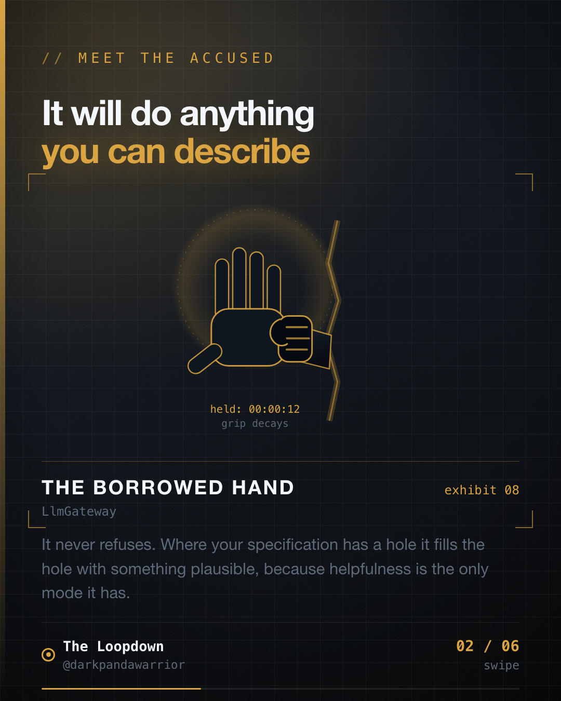

The API returned 200. The article published. Every single tag was silently dropped, and nothing anywhere said so.

I found it two days later, by accident, looking at something else.



## Wrong code gets caught. Plausible code ships.

A junior engineer fails in a way you can see. The code looks off, the naming is strange, something in the shape of it makes you slow down and read twice. That instinct is most of what code review actually is.

Borrowed work does not fail like that. Ask a model for something and it returns code that looks exactly right, because looking right is the thing it is best at. It compiles. It runs. It returns success. When your instructions run out, it does not stop and ask. It fills the gap with the most plausible thing, because being helpful is the only mode it has.

So the defect never lands in the syntax, which is where review is looking. It lands in the seam between what you asked for and what you meant, and it survives review precisely because it reads well.

Two from the same week, both in the tooling that publishes this series.

## One: the line that returned 200 and did nothing

The publisher pushes each article to the dev.to API. The line read:

```js
tags: tags.join(",")
```

Look at it. Tags are a list. The API wants tags. Join them. I would have approved this in a pull request without a second thought, and so would you.

That endpoint wants an array. Hand it a string and it does not reject the request, does not warn, does not fail. It returns `200 OK`, publishes the article, and drops every tag on the floor. Four tags, every post, silently.

There was no error to read. The publish log said published, because it was. The only way to catch it was to fetch the article back and look at what was actually on it:

```js
const landed = response.json?.tags || []
if (tags.length && !landed.length) {
    warn(`tags were rejected (sent ${tags.join(",")})`)
}
```

That check is three lines and I did not write it until after the damage, because the call had already told me it worked.

## Two: the snippet that fit perfectly and taught the wrong thing

This one is worse, and it is the one I keep thinking about.

Part of the tooling picks a code snippet out of each article to render onto a slide. I specified it plainly: take the first code block that fits the slide.

It did exactly that. Perfectly. Every time.

On a post about the five second window you get to call `startForeground()`, it selected a `WorkManager` snippet. Real API, correct Kotlin, lifted from the right file, would compile. Also completely unrelated to the point the slide was making. That deck was one push away from teaching a few thousand people the wrong lesson inside a beautifully rendered panel.

Nobody lied to me. I asked for a block that *fits*. I meant a block that *demonstrates the claim*. The gap between those two sentences is the entire bug, and it is invisible in the output, because the output looks great.

## Specify the predicate, not the shape

"A block that fits" is a shape. Shapes are easy to describe and easy to satisfy, which is exactly why they are dangerous: a shape can be satisfied perfectly by something useless.

"A block that contains the API this slide is about" is a predicate. It can be checked. It can fail. Something that fails loudly is worth more than something that succeeds vaguely.

The fix was one filter:

```js
.filter((b) => matcher.test(b.join("\n")))
```

and a deliberate decision that when nothing matches, the slide falls back to plain text rather than showing code that argues for something else. Four posts now have no code slide. That is the correct outcome. Four honest gaps beat four confident wrong answers.

## Verify the outcome, not the call

This generalises well past AI, and it is the part worth stealing.

A `200` means the server received your request. It does not mean the server did what you wanted. A successful `INSERT` means a row exists, not that it holds what you think. A migration that does not throw is not a migration that preserved your data.

```kotlin
// the call succeeded
val response = api.updateProfile(profile)
if (response.isSuccessful) return Result.success(Unit)

// what you actually wanted to know
val saved = api.getProfile()
check(saved.displayName == profile.displayName) {
    "server accepted the update and ignored displayName"
}
```

You will not do this everywhere, and you should not. Do it at the boundaries where a silent no-op is expensive: anything that publishes, anything that pays somebody, anything that migrates data, anything you cannot easily inspect afterwards.

## Review the seams, not the syntax

The practical version, for when you are reviewing work you did not personally type:

1. **Read the specification, not the diff.** The diff is the answer. The bug is usually in the question. Ask what was actually requested, and whether the code answers that or something adjacent.
2. **Find where the instructions ran out.** Every generated block has a boundary past which nobody said anything specific. That is where the plausible filler lives. Go there first.
3. **Distrust code that returns success.** Especially against an API you do not control. Confirm the effect happened.
4. **Make the check mechanical.** An assertion, a linter rule, a test. Your attention is the one component in this system guaranteed to degrade, and it degrades fastest exactly when the output looks good.

## The takeaway

Borrowed work does not fail like bad work. It fails like confident work that answers a question slightly next to the one you asked.

Specify the predicate, not the shape. Verify the outcome, not the call. Write the check down as something that runs, because the day you stop reading carefully is not announced in advance.

It will do anything you can describe. The trouble is what happens where you stopped describing.
