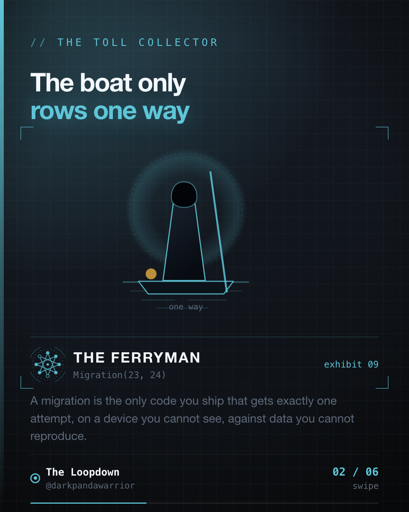
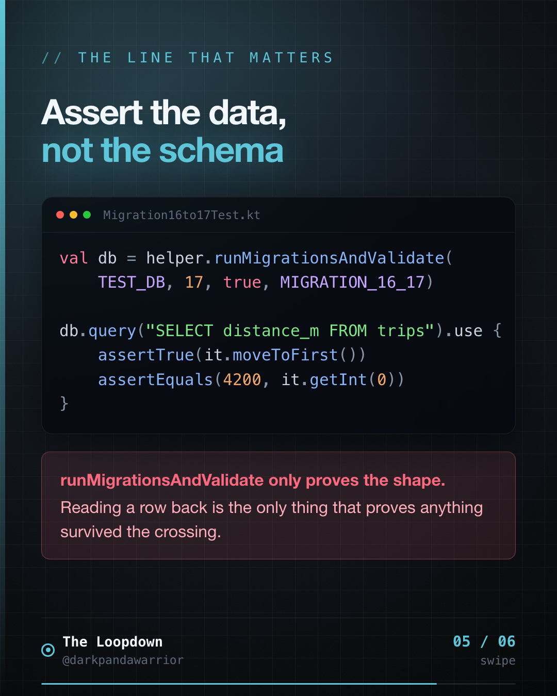
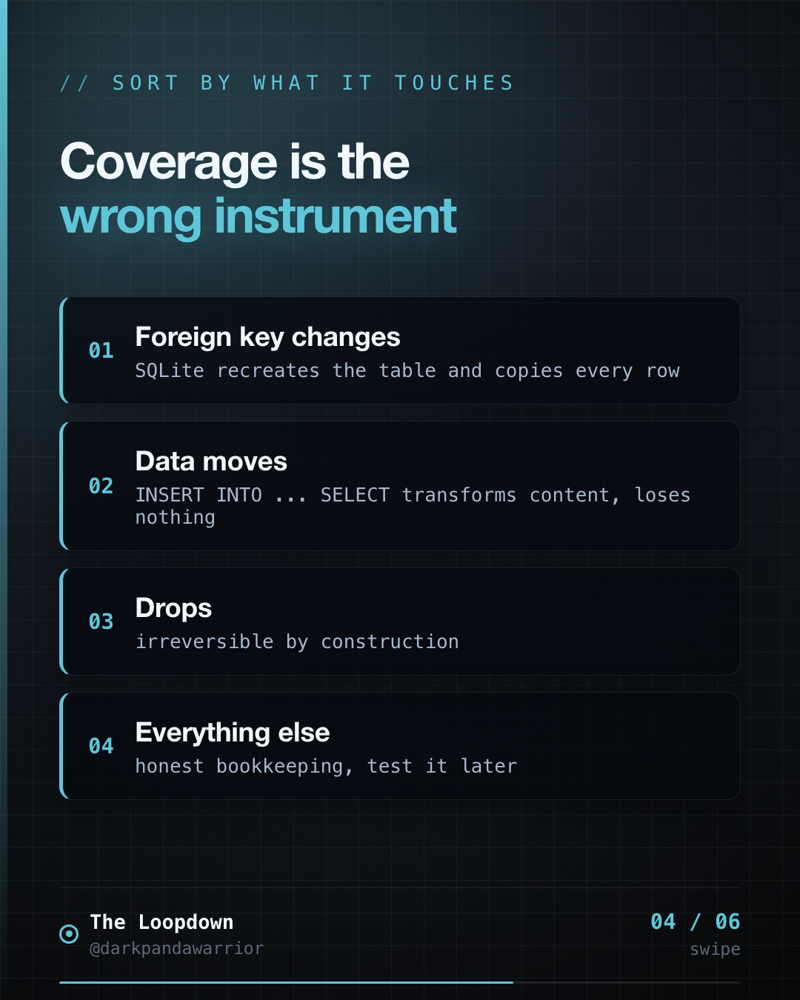
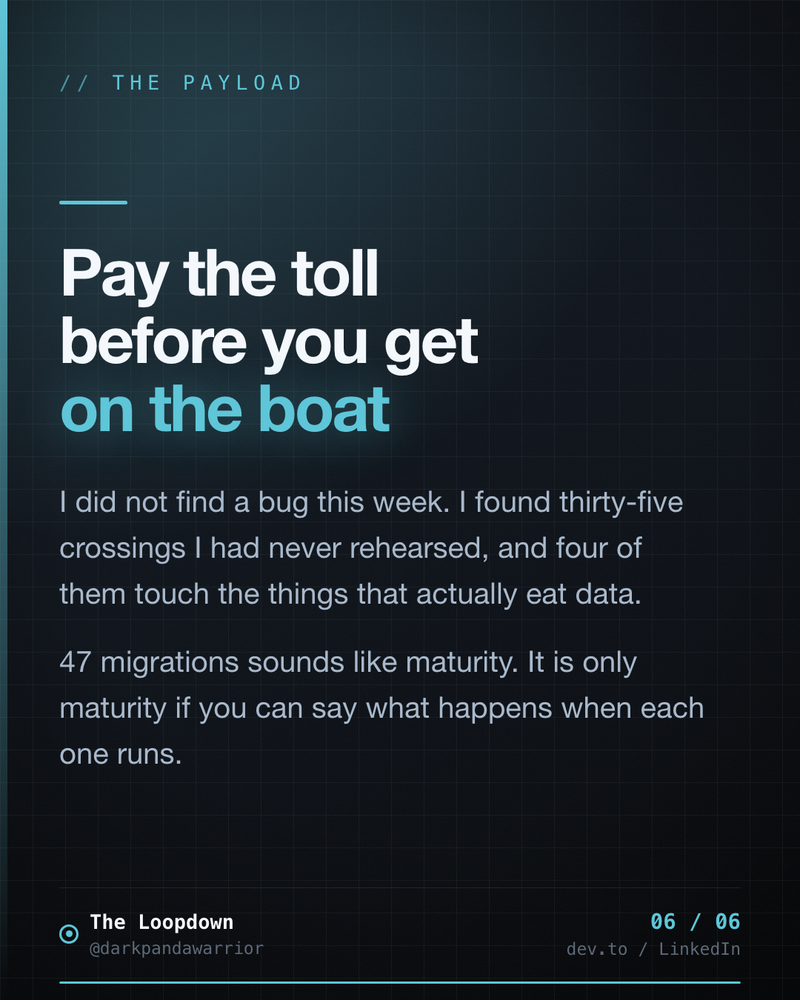

Forty-seven schema crossings in one app. Fifteen with a test behind them.

I would have told you, confidently, that it was fine. I have been quoting the migration count as a strength.



## A migration is the only code that gets one attempt

<!-- figures:start -->

<!-- figures:end -->

Everything else you ship has a second chance. A bad screen gets a hotfix. A wrong API call gets retried. A crash gets a patch release and an apologetic changelog entry.

A migration runs once, on a device you cannot see, against data you cannot reproduce, at a moment you do not choose. If it is wrong, the user's data is not broken. It is gone. There is no second attempt because the schema has already moved, and the row you needed to read in order to recover is the row that did not survive.

And yet it is routinely the least tested code in the codebase, because it looks trivial. One `ALTER TABLE`. Ship it.

## The audit

<!-- figures:start -->

<!-- figures:end -->

I ran a count across Mileway this week:

- **47** `Migration` objects
- schema version **48**
- **8** instrumentation test files, covering **15** version pairs

So roughly two thirds of the crossings have never once been executed against a real snapshot of the schema they claim to upgrade. They are trusted on read. Someone looked at the SQL, thought "yes, that looks right," and shipped it. Usually me.

The number itself did not bother me as much as what happened when I sorted it.

## Coverage is the wrong instrument

Percentage tells you nothing here, because migrations are not uniformly dangerous. Adding a nullable column is close to free. Touching a constraint is not. So I sorted the untested ones by what they actually do:

**Foreign key changes (5 to 6, 16 to 17).** SQLite cannot alter a constraint in place. The only way through is to create a new table with the new definition, copy every row across, drop the old one, and rename. That copy is a full data movement wearing the costume of a schema tweak. If a column order is off or a type coerces, rows land wrong and nothing throws.

**A data-moving migration (32 to 33).** `INSERT INTO ... SELECT`. This one does not change shape, it transforms content. A mismatched column order here loses no rows at all, which is exactly why it is the worst case: you get a full table of confidently wrong values and no error anywhere.

**A drop (47 to 48).** Irreversible by construction. Nothing to say about this one except that it should have had a test first.

Four migrations. That is the actual risk surface, out of thirty-five untested ones. Test those and you have bought most of the safety available for a fraction of the work.

## Two ways to write the test, and they are not equal

The standard path is `MigrationTestHelper`, which needs exported schemas:

```kotlin
ksp { arg("room.schemaLocation", "$projectDir/schemas") }
```

```kotlin
helper.createDatabase(TEST_DB, 16).apply {
    execSQL("INSERT INTO trips (id, distance_m) VALUES (1, 4200)")
    close()
}
val db = helper.runMigrationsAndValidate(TEST_DB, 17, true, MIGRATION_16_17)
```

The second path is the one I am actually on, and I only rediscovered it reading my own tests. This project runs `exportSchema = false`, which blocks `MigrationTestHelper` entirely. So the existing tests build the old schema by hand and drive it through a real SQLite connection:

```kotlin
val connection = BundledSQLiteDriver().open(path)
connection.execSQL("CREATE TABLE media_library (...)")   // the v39 shape, written out
connection.execSQL("INSERT INTO media_library VALUES (...)")
// then run MIGRATION_39_40 and assert
```

That works. It is a genuine test. But the two are not equivalent and the difference is worth being precise about, because it is the sort of thing you only notice when it bites.

`MigrationTestHelper` builds version 16 from **the schema Room actually exported at version 16**. The hand-written version builds it from **your memory of version 16**. If that memory is wrong, and after forty-odd crossings it eventually will be, the test constructs a table that never existed, migrates it successfully, and passes. Green the whole way, while production carries a shape your test has never seen.

So: hand-seeding is a valid answer to "exportSchema is off". It is not a free one. You are trading a verified starting point for a remembered one, and the interest on that trade compounds with every version.

If you can turn schema export on, turn it on. If you cannot, at least write the seed SQL by copying from the migration that created the table rather than from memory, and say so in a comment, which is what my better tests already do.

## Assert the data, not the schema

Whichever path you take, the important line is not the migration call. It is the query afterwards.

```kotlin
db.query("SELECT distance_m FROM trips WHERE id = 1").use { c ->
    assertTrue("the row did not survive the crossing", c.moveToFirst())
    assertEquals(4200, c.getInt(0))
}
```

`runMigrationsAndValidate` proves the resulting schema matches what Room expects. It says nothing about whether your rows are still there or still correct. Only reading one back does that.

For the data-moving ones, assert the count as well. If 1,200 rows go in, 1,200 come out, and if they do not you want a red test rather than a support ticket in four months.

And never leave `fallbackToDestructiveMigration()` in a shipping build. It converts "my migration has a bug" into "the user's data is deleted, silently, and the app looks fine". A development convenience that reads, in production, as a data-loss feature.

## The rules, short version

1. **Export schemas if you can.** `MigrationTestHelper` builds the old version from what Room actually exported. Hand-seeding builds it from what you remember, and after forty crossings those drift.
2. **Sort by what it touches, not by count.** Constraints, data movement, drops. Everything else is bookkeeping.
3. **Assert data, not just schema.** `runMigrationsAndValidate` checks shape. Read a row back to check truth.
4. **Count rows through a data move.** In equals out, or the test fails.
5. **No destructive fallback in release.** Ever.
6. **Write the test before the migration ships**, because after it ships you are no longer testing, you are doing forensics.

## The takeaway

<!-- figures:start -->

<!-- figures:end -->

I did not find a bug this week. I found thirty-five crossings I had never rehearsed, and four of them touch the things that actually eat data.

The uncomfortable part is that the count was a number I had been proud of. Forty-seven migrations sounds like maturity. It is only maturity if you can say what happens when each one runs, and until this week I could not.

The boat only rows one way. Pay the toll before you get on it.
