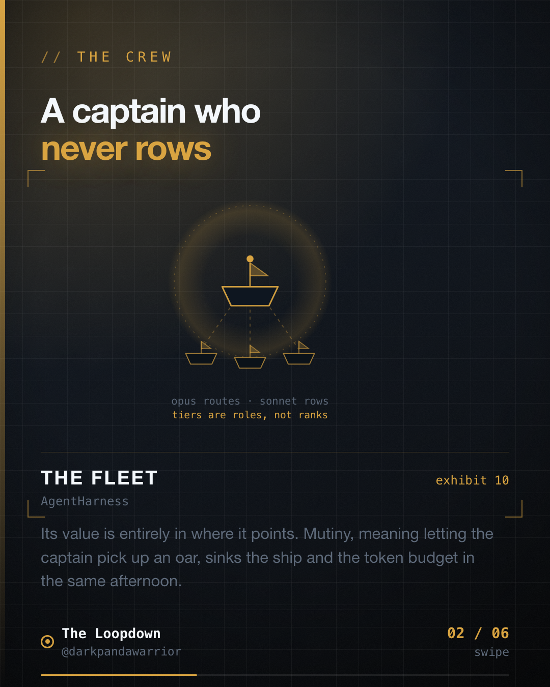

Two runs died on rate limits in the same week.

Not because the work was too big. Because the most expensive model in the fleet was doing the rowing.



## The wrong mental model

Model tiers arrive looking like a quality ladder. A small one, a medium one, a large one. So the instinct is obvious: the work matters, use the best one you can afford.

That instinct is what empties a budget, because it treats capability as the only axis and ignores volume completely. Capability is what you need for one hard decision. Volume is what you need for four hundred easy ones. Those are different problems and they want different answers.

They are roles, not ranks.

- **Mechanical work** stays a small-model job no matter how important the surrounding project is. A rename, a format, a lint sweep, an extraction. Importance does not transfer down into the difficulty of the individual step.
- **Bulk execution** is a mid-tier job, and this is where almost all real work actually lives. Twenty files, one pattern.
- **Orchestration and judgement** is where the largest model earns its price. Deciding what the work is. Splitting it. Ruling on the ambiguous case that the spec did not cover.

## The failure has a name

An orchestrator that starts doing the work itself is a captain picking up an oar. The ship stops steering at precisely the moment the volume shows up, which is precisely when steering was the thing you were paying for.

I wired my own harness this way early on. Top tier as planner and executor, because the work mattered and I wanted the best output at every step. It read as thoroughness at the time.

Two waves died on rate limits inside one week. The work was not unusually large. Every one of a few hundred mechanical steps had gone through the most expensive path available, and the budget was gone long before the actual judgement calls arrived. The runs did not fail at the hard part. They never reached the hard part.

## The fix was one sentence, and its grammar mattered

The fix was not a smaller model. It was making delegation **mandatory wording** in the orchestrator's prompt rather than advisory:

```
Delegate execution. Do not perform it.
```

Not "prefer to delegate". Not "you may delegate where appropriate". Those get read as permission, and permission loses to the more concrete instruction sitting next to it.

A model told to plan and execute will execute. Executing is specific and immediate; delegating is abstract and deferred. When two instructions compete, the concrete one wins, and "helpful" resolves toward doing the visible thing now.

This is the same failure as any under-specified interface. "You are the orchestrator" does not imply "and therefore you do not also do the work" to something built to be maximally useful. If a constraint matters, it has to be stated as a constraint, not implied by a role name.

## The routing rule

The version I run now:

1. **Pick the cheapest tier that covers the work.** Not the best available. The cheapest sufficient one.
2. **Escalate exactly one rung**, and only on verified failure or genuine spec ambiguity.
3. **Never escalate on volume.** Volume is the signal to go *down* a tier and parallelise, not up. This is the one people get backwards, and it is the expensive one.
4. **Keep the top tier's budget for deciding.** Its value is entirely in where it points. Every token it spends on execution is a token not spent on the call only it can make.

## This generalises past agents

The shape is not new. It is the same reasoning behind not running your analytics job on the primary database, not putting a senior engineer on a mechanical refactor, and not calling a paid geocoding API in a loop when a local lookup table covers ninety percent of cases.

The resource with the highest capability usually also has the lowest throughput and the highest cost per unit. Spending it on volume is how systems fall over, and it always feels like diligence while you are doing it.

## The takeaway

Tiers are roles, not ranks. Pick the cheapest one that covers the work, escalate one rung at a time and only on verified failure, and never escalate because there is a lot of something.

Then write the constraint into the prompt as a constraint. "The captain never rows" has to be said out loud, because a captain built to be helpful will absolutely pick up an oar, and it will look like enthusiasm right up until the ship stops.
